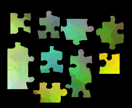

# The Jigsaw Piece Maker

A jigsaw puzzle pieces generator that levels the playing field.

It creates jigsaw puzzle pieces in multiple formats: svg, jpg, and png.  The
number and size of pieces are set by passing the script different options.  It
takes a while to run if doing a lot of pieces.  Extra JSON files are created
with details on size of pieces and adjacent pieces information which is commonly
used when verifying that two pieces can join together.

Samples from different generated puzzles:





Try out by running the `piecemaker.sh` script that will prompt for necessary options
and run piecemaker inside a docker container. It will use the files in the examples
directory by default.

```bash
# Build and run using docker
./piecemaker.sh
```

## Installing

Requires:

Python Packages:

* [Pillow](http://github.com/python-imaging/Pillow)
* [pixsaw](http://github.com/jkenlooper/pixsaw)
* [beautifulsoup4](http://www.crummy.com/software/BeautifulSoup/bs4/)
* [svgwrite](https://pypi.python.org/pypi/svgwrite)
* lxml

Other Software needed:

* [potrace](http://potrace.sourceforge.net/)

If on ubuntu or other debian based distro

```bash
apt-get --yes install libspatialindex8
apt-get --yes install optipng
apt-get --yes install python3-pil
apt-get --yes install potrace libffi-dev libxml2-dev python3-lxml python3-xcffib
apt-get --yes install librsvg2-bin
apt-get --yes install python3-pip
```


Install with pip in editable mode for developing and use virtualenv to isolate
python dependencies

```bash
python3 -m venv .venv
source .venv/bin/activate
pip install --upgrade --upgrade-strategy eager -e .
```


## Usage

See the script.py for more.  Not everything has been implemented. Use this
example command to create 100 randomly generated jigsaw puzzle pieces from
test.jpg image. This assumes that the 'test1' directory is empty since that is
where it will be placing all the generated files.  The test.jpg is the source
image that will be used when creating the pieces.  It is not modified.

```bash
piecemaker --dir test1  --number-of-pieces 100 test.jpg
```

Example of using an already existing svg file with jigsaw puzzle cut lines. The
'test2' directory should be empty as well. Note that the svg file
(test2-custom-cut-lines.svg) and the image (test.jpg) both need to be the same
width and height. Try this out by using a previously generated
'lines-resized.svg' from a different puzzle and a different image to create
a new puzzle with identical piece cuts.

```bash
piecemaker --dir test2 --svg test2-custom-cut-lines.svg test.jpg
```

## Other Suggested Tools

Create SVG files for jigsaws with tools from [proceduraljigsaw](https://github.com/proceduraljigsaw).

* [CustomShapeJigsawJs](https://proceduraljigsaw.github.io/CustomShapeJigsawJs/) A custom border jigsaw puzzle generator for laser cutting based on Voronoi tesselation
    * [proceduraljigsaw/CustomShapeJigsawJs](https://github.com/proceduraljigsaw/CustomShapeJigsawJs)
* [Fractalpuzzlejs](https://proceduraljigsaw.github.io/Fractalpuzzlejs/) Javascript web based circle grid fractal jigsaw puzzle generator for lasercutting.
    * [proceduraljigsaw/Fractalpuzzlejs](https://github.com/proceduraljigsaw/Fractalpuzzlejs)
* [OrganicPuzzleJs](https://proceduraljigsaw.github.io/OrganicPuzzleJs/) is a (pretty broken, but mostly functional) organic-shaped jigsaw generator with custom border support.
    * [proceduraljigsaw/OrganicPuzzleJs](https://github.com/proceduraljigsaw/OrganicPuzzleJs)
* [Gosperpuzzlejs](https://proceduraljigsaw.github.io/Gosperpuzzlejs/) Gosper curve fractal jigsaw generator
    * [proceduraljigsaw/Gosperpuzzlejs](https://github.com/proceduraljigsaw/Gosperpuzzlejs)
* [HexFractalpuzzlejs](https://proceduraljigsaw.github.io/Hexpuzzlejs/) Hexagonal grid fractal puzzle generator
    * [proceduraljigsaw/Hexpuzzlejs](https://github.com/proceduraljigsaw/Hexpuzzlejs)
* [ImpactPuzzle](https://github.com/proceduraljigsaw/ImpactPuzzle) Broken glass jigsaw puzzle generator.
* [CircleGridPuzzle](https://github.com/proceduraljigsaw/CircleGridPuzzle) Fractal jigsaw puzzle generator in Python.

SVG editing tools

* [SVGEdit Online Editor](https://svgedit.netlify.app/editor/index.html) is a fast, web-based, JavaScript-driven SVG drawing editor that works in any modern browser.
    * [SVGEdit](https://svg-edit.github.io/svgedit/)
    * [SVG-Edit/svgedit](https://github.com/SVG-Edit/svgedit)
* [GodSVG SVG editor](https://www.godsvg.com/)

## Contributing

Please contact [Jake Hickenlooper](mailto:jake@massive.xyz) or create an issue.

Any submitted changes to this project require the commits to be signed off with
the [git command option
'--signoff'](https://git-scm.com/docs/git-commit#Documentation/git-commit.txt---signoff).
This ensures that the committer has the rights to submit the changes under the
project's license and agrees to the [Developer Certificate of
Origin](https://developercertificate.org).

## License

[GNU Lesser General Public License v3.0](https://choosealicense.com/licenses/lgpl-3.0/)

## Maintenance

Where possible, an upkeep comment has been added to various parts of the source
code. These are known areas that will require updates over time to reduce
software rot. The upkeep comment follows this pattern to make it easier for
commands like grep to find these comments.

Example UPKEEP comment has at least a 'due:' or 'label:' or 'interval:' value
surrounded by double quotes (").
````
Example-> # UPKEEP due: "2022-12-14" label: "an example upkeep label" interval: "+4 months"
````

Show only past due UPKEEP comments.
```bash
make upkeep
```
